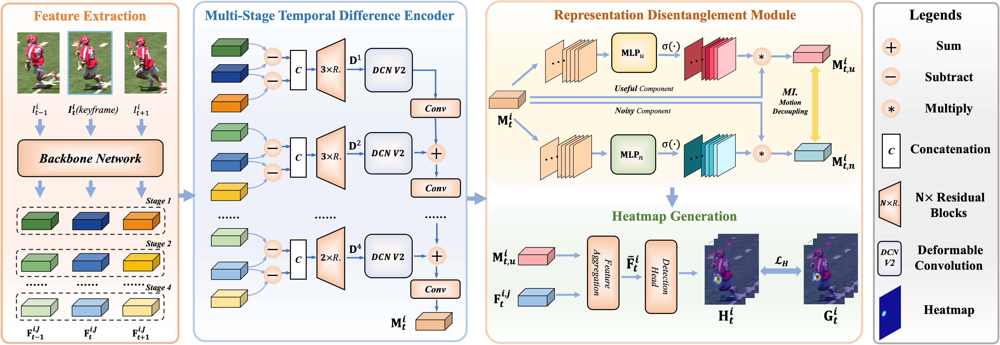
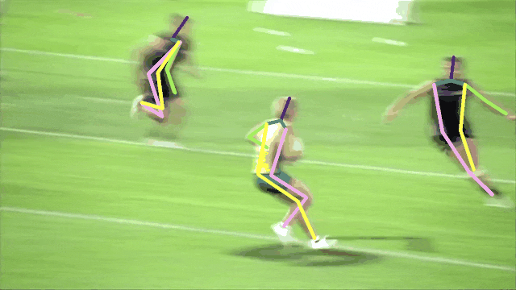
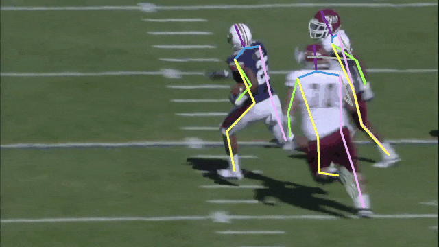
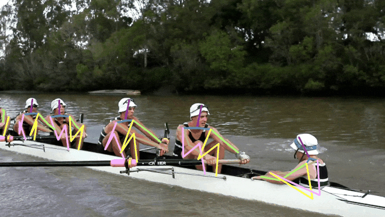
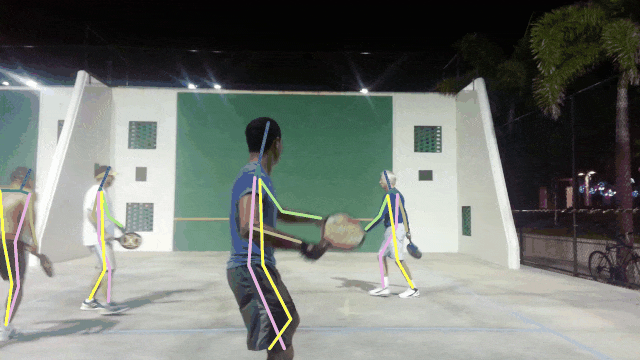
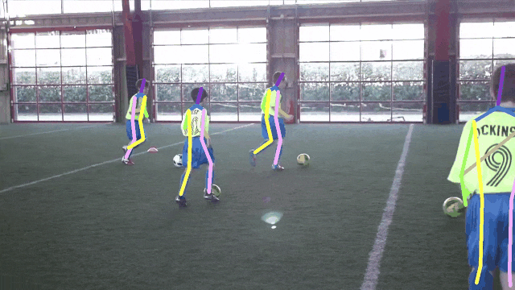
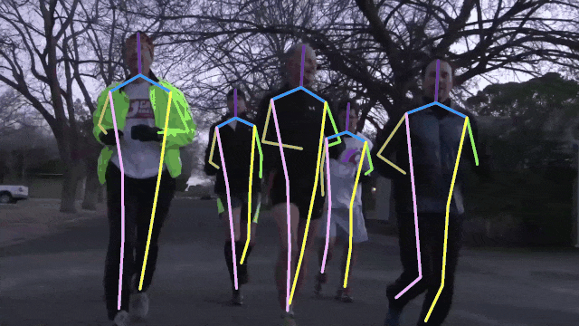
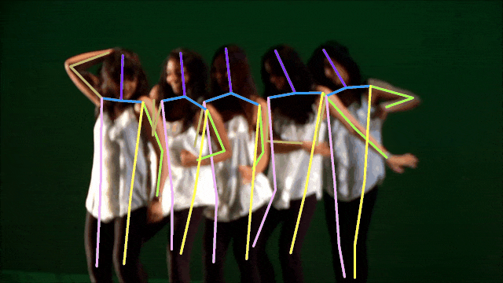
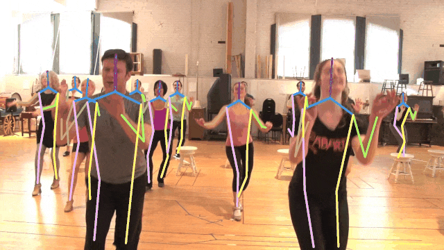

# Mutual Information-Based Temporal Difference Learning for Human Pose Estimation in Video (CVPR2023)

## Introduction

This is the official repository of **Mutual Information-Based Temporal Difference Learning for Human Pose Estimation in Video.**

Temporal modeling is crucial for multi-frame human pose estimation. Most existing methods directly employ optical flow or deformable convolution to predict full-spectrum motion fields, which might incur numerous irrelevant cues, such as a nearby person or background. Without further efforts to excavate meaningful motion priors, their results are suboptimal, especially in complicated spatio-temporal interactions. On the other hand, the temporal difference has the ability to encode representative motion information which can potentially be valuable for pose estimation but has not been fully exploited. In this paper, we present a novel multi-frame human pose estimation framework, which employs temporal differences across frames to model dynamic contexts and engages mutual information objectively to facilitate useful motion information disentanglement. To be specific, we design a multi-stage Temporal Difference Encoder that performs incremental cascaded learning conditioned on multi-stage feature difference sequences to derive informative motion representation. We further propose a Representation Disentanglement module from the mutual information perspective, which can grasp discriminative task-relevant motion signals by explicitly defining useful and noisy constituents of the raw motion features and minimizing their mutual information. These place us to [rank No.1 in the Crowd Pose Estimation in Complex Events Challenge on benchmark dataset HiEve](http://humaninevents.org/oltp.html?title=3), and achieve state-of-the-art performance on three benchmarks PoseTrack2017, PoseTrack2018, and PoseTrack21. 



## Visual Results

<p align='center'>


</p>

<p align='center'>

 
</p>

<p align='center'>


</p>

<p align='center'>
 

</p>


## Resources

**Paper**: [Mutual Information-Based Temporal Difference Learning for Human Pose Estimation in Video](https://arxiv.org/abs/2303.08475)

**Code**: under preparation


## Citation

```latex
@InProceedings{Feng_2023_CVPR,
    author    = {Feng, Runyang and Gao, Yixing and Ma, Xueqing and Tse, Tze Ho Elden and Chang, Hyung Jin},
    title     = {Mutual Information-Based Temporal Difference Learning for Human Pose Estimation in Video},
    booktitle = {Proceedings of the IEEE/CVF Conference on Computer Vision and Pattern Recognition (CVPR)},
    month     = {June},
    year      = {2023},
    pages     = {xxx}
}
```
